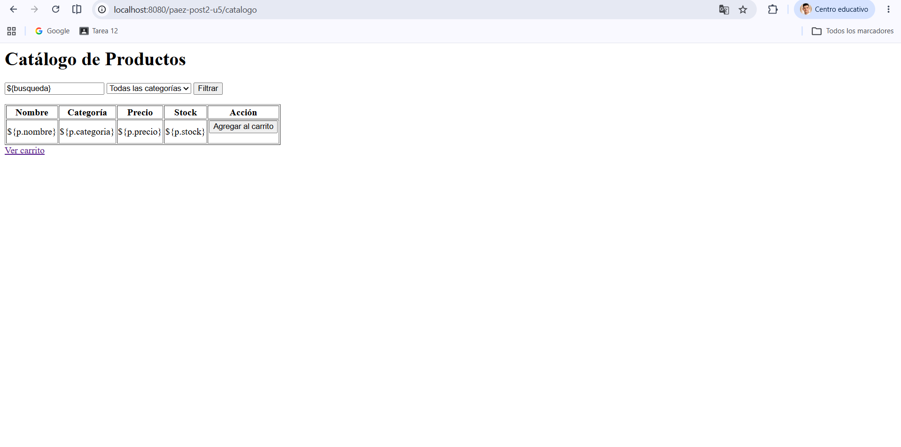
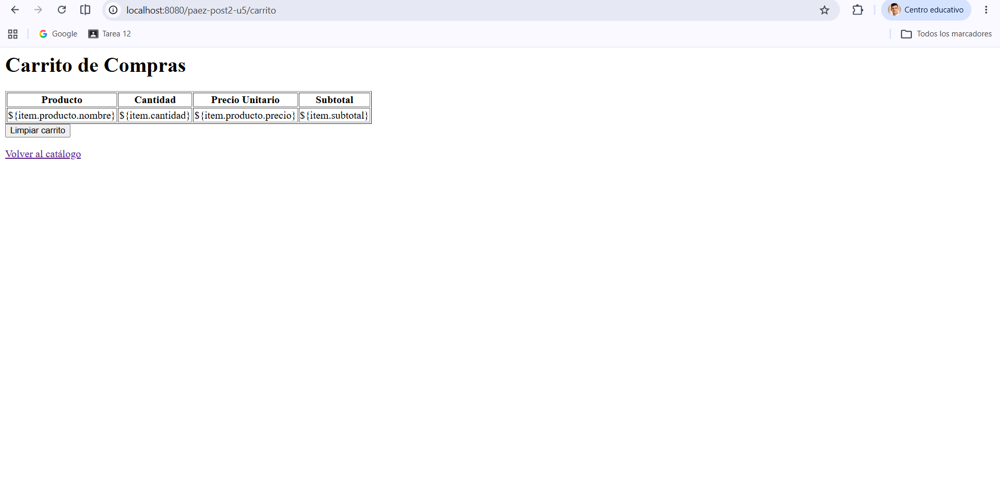

# Proyecto Web – Catálogo y Carrito

Este proyecto implementa un catálogo de productos con carrito de compras usando **Java Servlets + JSP + Tomcat**.

---

## 📌 Evidencias

### 🛍️ Catálogo de Productos

### 🛒 Carrito de Compras

